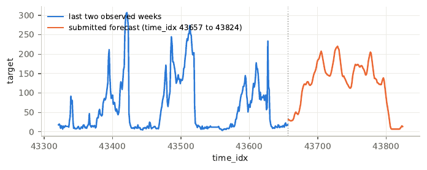
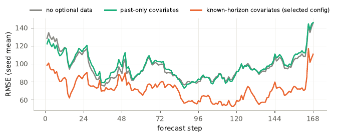
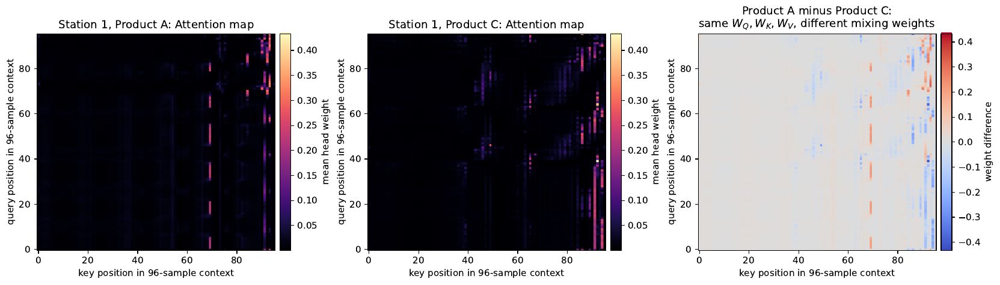
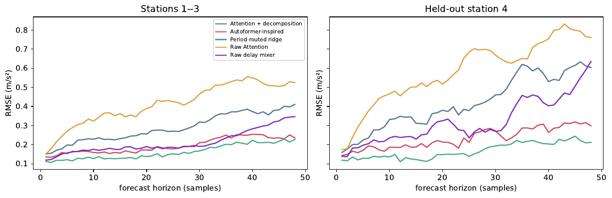

# Autoformer for Time Series Forecasting

**AI651 Deep Learning for Space, Time and Graphs, LUMS, Fall 2026. Programming Assignment 1.**
Ahmed Jawed (25280040).

Two tasks, one theme: when does a sequence model beat a well-chosen inductive bias, and how do you
get known future information into a Transformer without the architecture smoothing it away.

- **Task 1.** A controlled study on simulated vibration sensors: ridge baselines, raw attention, delay
  mixing and series decomposition, combined in a 2x2 design, deployed against a held-out sensor.
- **Task 2.** A from-scratch Autoformer on an anonymised real-world hourly series with a 168-step
  horizon, scored on a public leaderboard. **Final entry: RMSE 62.95, rank 1 at submission,**
  with 53.7k parameters and 20 epochs.

Full write-up: [`report/main.pdf`](report/main.pdf).

---

## Task 2 at a glance

| Attempt | Model | P | E | Leaderboard RMSE | sMAPE |
|---|---|---:|---:|---:|---:|
| 1 | Autoformer, covariates through the embedding, last-value anchoring | 33,891 | 15 | 81.56 | 57.8 |
| 2 | + nonlinear covariate encoder (per-step MLP in the embedding) | 38,979 | 16 | 81.93 | 59.6 |
| **3** | **+ direct per-hour covariate head, no anchoring** | **53,670** | **20** | **62.95** | **49.6** |

Each attempt is a 3-seed ensemble, chosen on a chronological validation split before it was submitted.
The leaderboard was used for confirmation only (5 attempts allowed, 3 used).

<p align="center">
 
</p>
<p align="center"><sub>Left: last two observed weeks and the submitted forecast. Right: per-step validation RMSE with and without the optional covariates (seed mean over 51 held-out weeks).</sub></p>

### What made the difference

1. **Where the covariates enter matters more than whether they are used.** Ten optional external
   variables are given for the forecast horizon as well as the past. As past-only encoder inputs they
   did nothing (RMSE 99.0 vs 97.7 without them). As known-in-advance decoder marks they cut RMSE by
   24% (to 74.4). This is the required ablation, run over 3 seeds.
2. **The Autoformer was still throwing most of that signal away.** A gradient-boosting model on the
   per-hour horizon covariates alone, with no sequence model, scored 57.0 on the same weeks where the
   Autoformer scored 69.3. The covariates entered through the embedding and then passed through the
   moving-average decompositions and Auto-Correlation mixing, which smooth the hour-by-hour signal
   that sets the peaks.
3. **A direct path fixed it.** A small per-hour MLP (36 inputs, 64, 64, 1) from each horizon hour's
   known inputs straight to that hour's output, added to the Autoformer forecast. Decomposition and
   Auto-Correlation are unchanged and model what the covariates do not explain. On two historical
   years this was 8.3 RMSE better per winter week (24 of 33 weeks won, every seed better than every
   attempt-1 seed). On the leaderboard it was 18.6 better.

```
                 past window (168 h)                       horizon marks (168 h, known in advance)
                        |                                              |
              value embed + covariate embed                            |
                        |                                              |
   +--------------------v--------------------+                         |
   |  Encoder: decomp -> AutoCorr -> decomp  |                         |
   |           -> FFN -> decomp              |                         |
   +--------------------+--------------------+                         |
                        | cross                                        |
   +--------------------v--------------------+          +--------------v--------------+
   |  Decoder: seasonal path (AutoCorr x2)   |          |  Direct covariate head      |
   |           trend path (accumulated MA)   |          |  per-hour MLP 36-64-64-1    |
   +--------------------+--------------------+          +--------------+--------------+
                        |                                              |
                        +----------------------(+)----------------------+
                                                |
                                     168-step forecast, floored at p1
```

### What did not work (all 3 seeds, same protocol)

Log target (better MAE, unstable RMSE), window-relative normalisation, a 27-model ensemble (0.997
correlated with attempt 1), refitting on more recent history, winter-weighted loss, square-root target,
peak-accumulation features, larger decomposition kernel, longer trailing covariate means. Each is in the
report with numbers. Two of them were submitted anyway and taught the lesson in the handout: one scored
week cannot separate models that a year of validation rates as close.

### Validation protocol

Chronological, assuming the recovered 24-step cycle is one day:

| Stage | Steps | Purpose |
|---|---|---|
| fit | [0, 26304) | training windows, stride 1 |
| early stop | [26304, 35064) | origins every 24 steps |
| compare | [35088, 43656) | 51 non-overlapping 168-step blocks, phase-aligned with the hidden week |

A second fold one cycle earlier (fold A) scores winter weeks from a different year. Every design claim
rests on 3 seeds and a paired per-block comparison. Winter-like weeks (the hidden week's season) were
tracked separately because they are much noisier and predicted the leaderboard: the edge-week RMSE of
attempt 1 was 81.97, its leaderboard RMSE 81.56.

### Reproduce the final entry

From `Question 2 - Leaderboard/`:

```bash
pip install "torch>=2.4" numpy pandas matplotlib
for s in 2 3 4; do
python -m pa1q2.train --cov future --d-model 16 --d-ff 32 --mark-kernel 5 \
  --horizon-mark 1 --pad replicate --cov-head 64 --lr 1e-3 --lr-decay 0.8 \
  --max-epochs 10 --patience 3 --stage final --out runs/final_v9 \
  --seed $s --tag fin_head64
done
python -m pa1q2.submission runs/final_v9/future-log0-ph1-L168-d16-s2-fin_head64.json \
  runs/final_v9/future-log0-ph1-L168-d16-s3-fin_head64.json \
  runs/final_v9/future-log0-ph1-L168-d16-s4-fin_head64.json
```

`submission.py` rebuilds each member from its saved arguments, loads the weights, asserts that the
trainable parameter count matches the record, floors each forecast at the 1st percentile of the fit
data, averages, and writes `submission/predictions.txt` (168 values, `time_idx` 43657 first) and
`submission/declaration.json`. Declared **P = 53,670** (3 x 17,890) and **E = 20** (7 + 7 + 6 epochs
run). Seven seeds were trained. Seeds 2, 3 and 4 were chosen on the early-stopping set only, see
`submission_snapshots/covhead_s2_s3_s4_2026-09-29/README.md`.

```bash
python -m unittest discover -s tests      # chronological boundaries, submission writer
```

---

## Task 1 at a glance

Simulated vibration sensors whose operating pace (period 14 to 36 samples) changes between runs, on top
of a slow drift. 96-sample context, 48-step horizon. Three implementations were written into the
supplied harness: `RawAttentionForecaster.forward`, `SeriesDecomposition.forward` and
`aggregate_delays` (vectorised circular delay aggregation).

| Model | Established RMSE | Held-out sensor RMSE | Params |
|---|---:|---:|---:|
| Shared ridge | 0.767 | 0.876 | 4,608 |
| Period-routed ridge | **0.166** | **0.173** | 59,904 |
| Raw Attention | 0.426 | 0.607 | 368,368 |
| Raw delay mixer | 0.219 | 0.342 | 368,370 |
| Attention + decomposition | 0.297 | 0.441 | 373,024 |
| Autoformer-inspired (both) | 0.199 | 0.239 | 373,026 |

<p align="center">
 
</p>
<p align="center"><sub>Left: the same learned projections produce different attention maps for two operating paces. Right: validation RMSE along the horizon for the four neural models.</sub></p>

Findings: an explicit pace variable (period routing) beats every neural model at 6x fewer parameters and
transfers to an unseen sensor, because pace is shared by the whole line while sensor details are not.
Decomposition and delay mixing each help on their own, and their gains overlap rather than stack
(combined MSE gain 0.142 against 0.227 if additive). The deployment choice, made before the test set
was unsealed, was the routed ridge for both populations.

---

## Repository layout

```
Question 1/
  Assignment1.ipynb          executed PA1_PRESET=full notebook (Outputs 1.1 to 4.3)
  harness/                   supplied harness (data generator, models, diagnostics)
  results/design/            exported tables and figures
Question 2 - Leaderboard/
  pa1q2/
    autoformer.py            Autoformer: series decomposition, Auto-Correlation, direct covariate head
    train.py                 windows, training loop, resumable early stopping
    data.py                  loading, folds, covariate features, winter-week slice
    submission.py            floored ensemble, P/E declaration with parameter recount
    baselines.py refit.py compare_*.py figures.py
  results/                   ablation, baselines, fold comparisons, figures
  submission/                the scored forecast (attempt 3) and declaration.json
  submission_snapshots/      every candidate built, incl. all three attempts with leaderboard results
  jobs_*.txt, run_queue.sh   exact argument lists of every run
  tests/
report/
  main.tex task1_responses.tex task2.tex ai_disclosure.tex
  figures/                   numbered PDF figures used in the report
  main.pdf
docs/                        PNG renders of four figures for this README
```

Trained weights (`*.pt`) are not committed. Every run's arguments, best epoch, early-stopping RMSE
and forecast are in its `.json` record, so the tables in the report can be regenerated without
retraining.

## References

- Wu, Xu, Wang, Long (2021). Autoformer: Decomposition Transformers with Auto-Correlation for
  Long-Term Series Forecasting. NeurIPS. The model here is written from scratch following the paper
  and the structure of [thuml/Autoformer](https://github.com/thuml/Autoformer).
- Vaswani et al. (2017). Attention Is All You Need.
- Zeng et al. (2023). Are Transformers Effective for Time Series Forecasting?

Generative AI tools were used in this assignment. The prompts, outputs and my edits are disclosed in
the last section of the report.
